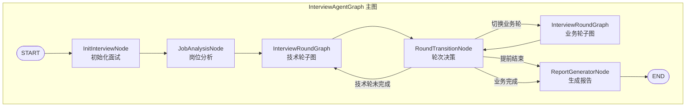
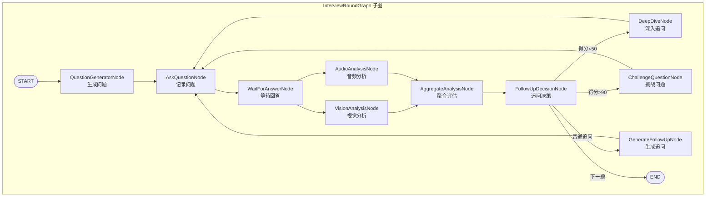

# AI 面试官系统

基于 Spring AI Alibaba + LangGraph4j 构建的多模态 AI 面试系统，支持实时视频分析、语音评估和智能追问。

## 技术栈

| 组件 | 版本 | 说明 |
|------|------|------|
| Java | 21 | 支持 Virtual Threads |
| Spring Boot | 3.4.4 | 基础框架 |
| Spring AI | 1.0.0 | Spring 官方 AI 框架 |
| Spring AI Alibaba | 1.0.0.2 | DashScope 原生集成（Chat/Vision/ASR） |
| LangGraph4j | 1.8.11 | 有状态多步骤工作流引擎 |
| PostgreSQL + pgvector | - | 数据库与向量存储 |
| MyBatis-Plus | 3.5.9 | ORM 框架 |

| 用途 | 模型 | 说明 |
|------|------|------|
| 文本生成/评估 | qwen-plus | 面试问题生成、答案评估、情感分析 |
| 视觉分析 | qwen-image-2.0-pro | 视频帧表情识别、肢体语言分析 |
| 语音转录 | paraformer-realtime-v2 | 实时 ASR 语音转文字 |

## 核心功能

- **智能面试流程**: 根据简历和岗位自动生成针对性问题，支持技术基础、项目经验、业务理解、软技能等多维度考察
- **多分支追问策略**: 根据回答质量动态选择追问策略（普通追问/低分深入/高分挑战）
- **并行多模态评估**: 视觉分析（表情/肢体语言）与音频分析（语调情感/流畅度）并行执行
- **实时交互**: WebSocket 实时推送问题和情感反馈，面试结束生成综合报告

## 整体架构

系统采用 **LangGraph4j 主图 + 子图** 架构，将面试流程建模为有向状态图。主图管理整体面试流程（岗位分析→技术轮→业务轮→报告），每个轮次通过可复用的子图实例执行。



### 子图架构（并行多模态分析 + 多分支追问）



### 关键架构特性

| 特性 | 说明 |
|------|------|
| **并行分析** | 视觉分析和音频分析同时执行，减少评估延迟 |
| **多分支路由** | 根据得分动态选择追问策略（低分深入/高分挑战/普通追问） |
| **条件聚合** | 多个分析节点完成后汇聚到聚合节点 |

### 路由决策逻辑

**追问路由（EvaluationRouter）**：

| 得分范围 | 决策 | 说明 |
|---------|------|------|
| < 50 | DEEP_DIVE | 低分深入追问，确认是否真的存在不足 |
| > 90 | CHALLENGE_MODE | 高分挑战模式，提出更有挑战性的问题 |
| 50-90 且需追问 | FOLLOW_UP | 普通追问，深入挖掘 |
| 其他 | NEXT_QUESTION | 进入下一题 |

**轮次切换路由（RoundTransitionRouter）**：

| 条件 | 转换 |
|------|------|
| 技术轮完成 && 平均分 ≥ 75 | 技术轮 → 业务轮 |
| 技术轮完成 && 平均分 < 75 | 继续技术轮 |
| 业务轮完成 | 生成报告 |
| 连续3次高分 (≥85分) | 提前结束 |

### 多模态分析流水线

```
视频帧 → qwen-image-2.0-pro → 表情/肢体语言评分 ─┐
                                                 ├─→ 聚合评估
音频数据 → ASR转录 → qwen-plus → 语调情感分析 ───┘
```

### 熔断与容错

- **LLM 熔断**: 连续失败 3 次自动终止图执行，`CircuitBreakerHelper` 统一管理
- **重试策略**: 最大重试 3 次，指数退避（1s→2s→4s），仅对 429/5xx 重试
- **递归限制**: 主图 25，子图 15
- **节点兜底**: 各节点 catch 异常后返回默认值并递增失败计数

## 前后端交互

系统采用 **REST API + WebSocket** 双通道通信：REST 处理核心流程控制，WebSocket 处理实时数据传输（视频帧、音频流、情感反馈）。

### REST API

| 端点 | 方法 | 描述 |
|------|------|------|
| `/api/interview/start` | POST | 开始面试 |
| `/api/interview/answer` | POST | 提交答案 |
| `/api/interview/session/{sessionId}` | GET | 获取会话状态 |
| `/api/interview/end/{sessionId}` | POST | 结束面试 |
| `/api/interview/report/{sessionId}` | GET | 获取面试报告 |
| `/api/health` | GET | 健康检查 |
| `/api/info` | GET | 服务信息 |

### WebSocket

**连接地址**: `ws://localhost:8080/ws/interview/{sessionId}`

客户端 → 服务端：

| 类型 | 描述 |
|------|------|
| `video_frame` | 视频帧（实时表情分析） |
| `audio_chunk` | 音频块（语音转写） |
| `answer_complete` | 完整回答提交 |

服务端 → 客户端：

| 类型 | 描述 |
|------|------|
| `new_question` | 推送新面试问题 |
| `emotion_update` | 情感分析结果 |
| `evaluation_result` | 答案评估结果 |
| `final_report` | 最终面试报告 |

## 项目结构

```
src/main/java/com/zunff/interview/
├── agent/
│   ├── graph/                           # LangGraph4j 图定义
│   │   ├── InterviewAgentGraph.java     # 主图（岗位分析→技术轮→业务轮→报告）
│   │   └── InterviewRoundGraph.java     # 轮次子图（并行分析+多分支追问）
│   ├── nodes/                           # 图节点
│   │   ├── VisionAnalysisNode.java      # 视觉分析节点
│   │   ├── AudioAnalysisNode.java       # 音频分析节点
│   │   ├── AggregateAnalysisNode.java   # 聚合评估节点
│   │   ├── ChallengeQuestionNode.java   # 高分挑战节点
│   │   ├── DeepDiveNode.java            # 低分深入追问节点
│   │   └── ...
│   └── router/                          # 路由决策
│       ├── EvaluationRouter.java        # 追问路由（多分支）
│       └── RoundTransitionRouter.java   # 轮次切换路由
├── config/                              # 配置类
├── controller/                          # REST 控制器
├── model/                               # 数据模型
├── service/                             # 业务服务
├── state/
│   └── InterviewState.java              # 面试状态定义
└── websocket/                           # WebSocket 处理
```

## 快速开始

**前置要求**: JDK 21+、Maven 3.9+、PostgreSQL + pgvector、DashScope API Key

1. 复制 `application-example.yml` 为 `application-dev.yml` 并填写配置
2. 运行: `mvn spring-boot:run -Dspring-boot.run.profiles=dev`
3. 测试: `python3 test/test_api.py`

访问端点:
- Swagger UI: `http://localhost:8080/swagger-ui/index.html`
- LangGraph Studio: `http://localhost:8080/studio`

## 配置说明

```yaml
interview:
  session:
    max-technical-questions: 6   # 技术轮最大问题数
    max-business-questions: 4    # 业务轮最大问题数
    round-pass-score: 75         # 轮次通过分数阈值
    high-score-threshold: 85     # 高分阈值（触发挑战模式）
    consecutive-high-for-early-end: 3  # 连续高分次数触发提前结束
    max-follow-ups-technical: 3  # 技术轮每题最大追问数
    max-follow-ups-business: 2   # 业务轮每题最大追问数
```

## 参考资料

- [LangGraph4j 官方文档](https://langgraph4j.github.io/langgraph4j/)
- [Spring AI 官方文档](https://docs.spring.io/spring-ai/reference/)
- [Spring AI Alibaba 官方文档](https://java2ai.com/)
- [通义千问 API 文档](https://help.aliyun.com/zh/dashscope/)

## License

MIT License
