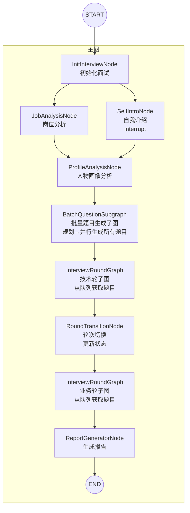
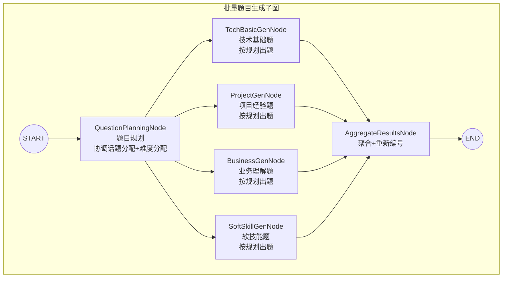
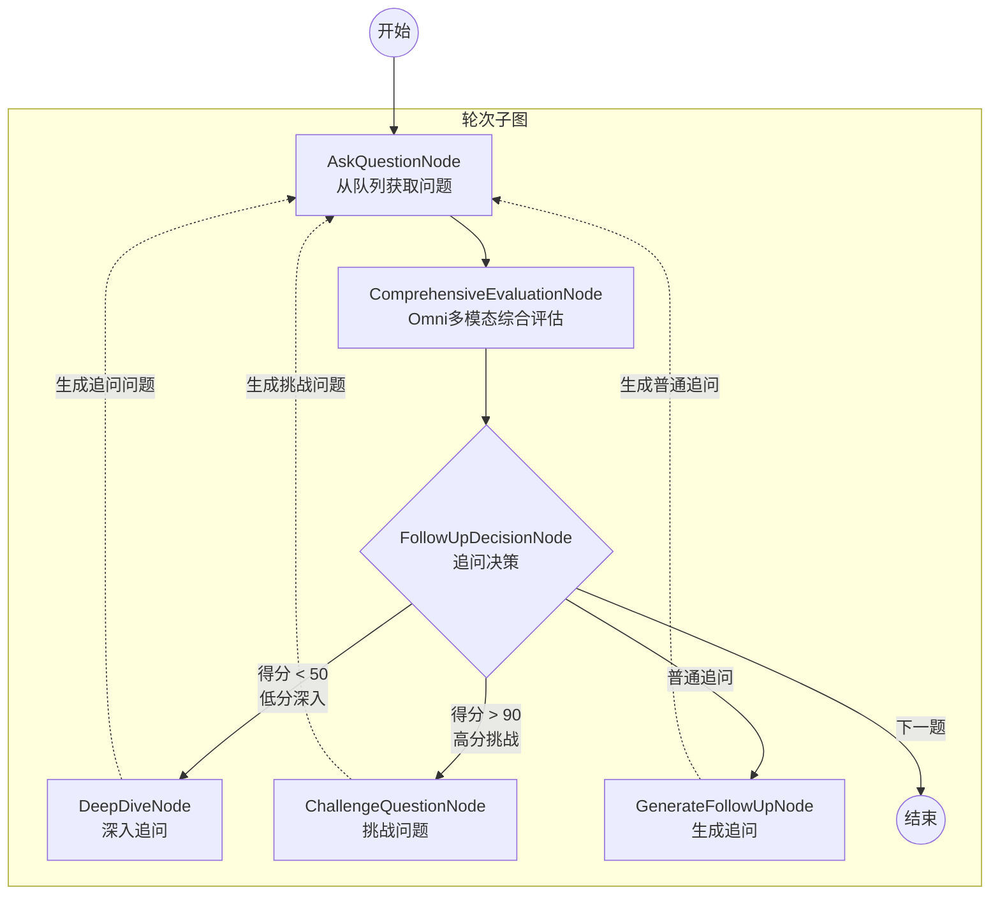
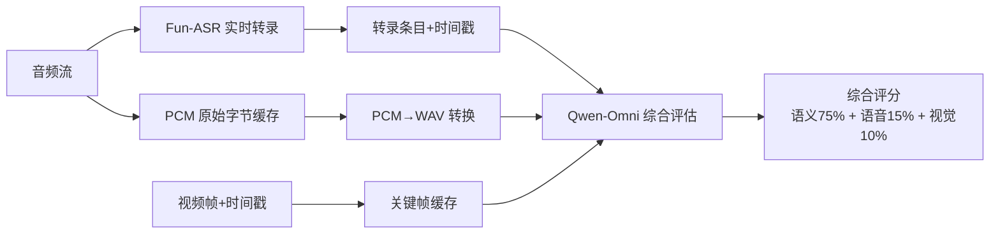
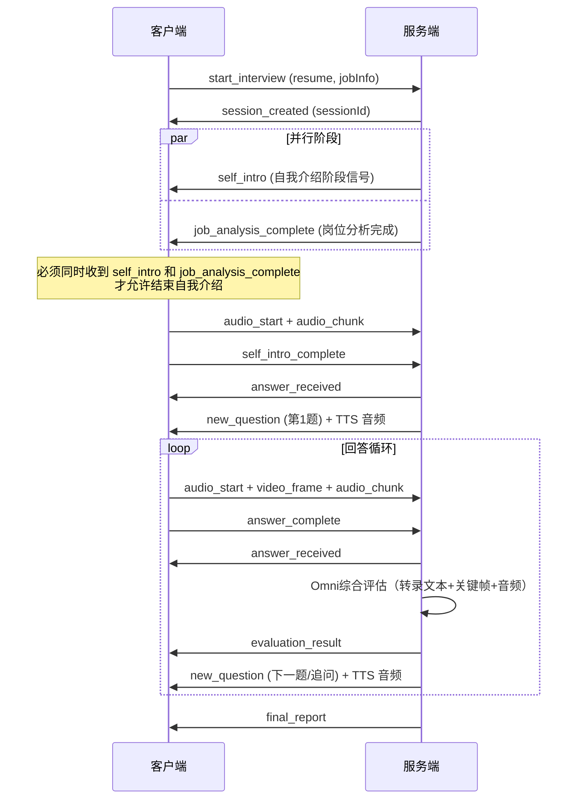

# AI 面试官系统

基于 Spring AI + LangGraph4j 构建的多模态 AI 面试系统，支持实时视频分析、语音评估和智能追问。

> 前端仓库：[https://github.com/zunff/interview-agent-frontend](https://github.com/zunff/interview-agent-frontend)

## 技术栈

| 组件 | 版本 | 说明 |
|------|------|------|
| Java | 21 | 支持 Virtual Threads |
| Spring Boot | 3.4.4 | 基础框架 |
| Spring AI | 1.0.0 | Spring 官方 AI 框架（OpenAI 兼容 API） |
| DashScope SDK | 2.22.5 | 阿里云灵积模型服务 SDK（ASR/TTS） |
| LangGraph4j | 1.8.11 | 有状态多步骤工作流引擎 |
| PostgreSQL + pgvector | - | 数据库与向量存储 |
| MyBatis-Plus | 3.5.9 | ORM 框架 |

| 用途 | 说明 |
|------|------|
| 大语言模型 (qwen3.5-plus/flash) | 面试问题规划、问题生成、追问决策 |
| Omni 多模态模型 (qwen3.5-omni-plus) | 综合评估：视频帧+音频+文本一次调用，以原始音频为主要评分依据 |
| 语音模型 (Fun-ASR-Realtime) | 实时 ASR 语音转文字，支持句级时间戳 |
| TTS 语音合成 (Qwen-TTS-Realtime) | WebSocket 流式合成，Opus 格式输出 |

## 核心功能

- **智能面试流程**: 根据简历和岗位自动生成针对性问题，支持技术基础、项目经验、业务理解、软技能等多维度考察
- **多分支追问策略**: 根据回答质量动态选择追问策略（普通追问/低分深入/高分挑战）
- **Omni 多模态综合评估**: 一次调用 Qwen-Omni 模型综合分析原始音频(WAV)、视频帧+时间戳、ASR转录文本，按权重评分（语义75% / 语音副语言15% / 视觉10%）。以原始音频为语义评估的主要依据，ASR文本仅作参考，消除同音词错误影响
- **实时交互**: WebSocket 实时推送问题，TTS 语音合成通过 BinaryMessage 流式推送 Opus 音频，实时ASR转录（带时间戳缓存）

## 整体架构

系统采用 **LangGraph4j 主图 + 批量题目生成子图（含规划节点） + 轮次子图** 架构，将面试流程建模为有向状态图。主图管理整体面试流程（岗位分析 ‖ 自我介绍 → 人物画像 → 题目规划 → 批量题目生成 → 技术轮 → 轮次切换 → 业务轮 → 报告），批量题目子图先由规划节点协调4类题目的话题分配，再并行生成，轮次子图通过可复用的子图实例执行。



### 批量题目生成子图（并行生成）



**批量生成流程**：
- 人物画像分析完成后，先进入 **QuestionPlanningNode**（题目规划节点）
- 规划节点分析候选人画像和岗位要求，为4类题目分配不同的话题和难度分布，避免话题重叠
- 4类题目按规划并行生成（技术基础、项目经验、业务理解、软技能）
- 聚合节点负责合并题目并重新编号
- 生成完成后题目存入状态队列，轮次执行时直接获取（追问除外）

### 轮次子图架构（Omni 综合评估 + 多分支追问）



### 关键架构特性

| 特性 | 说明 |
|------|------|
| **并行初始化** | 岗位分析与自我介绍并行执行，前端需同时收到两个完成信号后才可推进。使用 LangGraph4j 的并行节点执行机制实现真正的并行 |
| **批量题目生成** | 人物画像分析完成后，通过 BatchQuestionSubgraph 并行生成所有技术轮和业务轮题目，提升响应速度，避免每题等待生成 |
| **Omni 综合评估** | 一次调用 Qwen-Omni 同时分析文本+音频+视频帧，模型可交叉理解多模态信号 |
| **时间戳对齐** | 转录文本和关键帧都携带 UTC 时间戳，模型可根据时间对应关系综合判断 |
| **多分支路由** | 根据得分动态选择追问策略（低分深入/高分挑战/普通追问），追问为实时生成 |
| **多模态降级** | multimodalEnabled=false 时自动降级为纯文本评估（qwen3.5-flash） |
| **虚拟线程池** | 使用 Java 21 虚拟线程提供高性能异步执行，统一管理所有异步任务（面试启动、TTS 合成、图并行节点等） |

### 评估权重

| 维度 | 权重 | 数据来源 | 评分依据 |
|------|------|----------|----------|
| 语义内容（准确性/深度/逻辑/表达） | 75% | 原始音频(WAV) + ASR文本参考 | **以音频为准**评估回答内容；ASR文本仅作参考，存在同音词错误 |
| 语音副语言（语气/语速/停顿/自信度） | 15% | 原始 PCM 音频（转 WAV） | 模型从音频直接判断 |
| 关键帧（表情/肢体语言） | 10% | 视频帧截图 | 模型从视频帧判断 |

### 路由决策逻辑

**子图 Router（两阶段决策）**：

采用 **代码预判 + LLM 精细决策** 两阶段策略。代码规则处理常规情况，LLM 处理边界模糊场景。

| 规则 | 条件 | 决策 |
|------|------|------|
| 已达追问上限 | used ≥ max | NEXT_QUESTION |
| 低分+弱点 | adjustedScore < 50 + 有弱点 + 余量≥2 | DEEP_DIVE |
| 极高分+无弱点 | adjustedScore > 90 + 首轮 + 余量≥2 | CHALLENGE_MODE |
| 表现好 | adjustedScore ≥ 75 + 无弱点 | NEXT_QUESTION |
| 最后一次额度 | remaining ≤ 1 | concern→FOLLOW_UP，否则看质量 |
| 有余量+有弱点/模态异常 | hasWeakness/concern | FOLLOW_UP |

**难度校准**：adjustedScore 根据题目难度自动调整——hard 题 +15（50 分≈优秀），medium 题不变，easy 题 -10。短回答由 LLM 自然评估，低分自动触发 DEEP_DIVE。

**主图轮次切换**：

技术轮结束后，`RoundTransitionNode` 更新 `currentRound` 状态为业务轮，然后通过固定边进入业务轮。业务轮结束后直接生成报告。

### 多模态评估流水线



### 批量题目生成流程

**生成时机**：人物画像分析完成后立即触发

**并行策略**：
- 使用 LangGraph4j 的并行节点机制，同时启动 4 个生成节点
- 每个节点独立调用 LLM，生成特定类型的题目
- 虚拟线程池保证真正的并行执行，而非并发调度

**题目类型**：
| 节点 | 题目类型 | 数量配置 | 说明 |
|------|----------|----------|------|
| TechBasicGenNode | 技术基础 | jobAnalysis.technicalBasicCount | 基于岗位要求的技术栈 |
| ProjectGenNode | 项目经验 | jobAnalysis.projectCount | 基于简历项目经历 |
| BusinessGenNode | 业务理解 | jobAnalysis.businessCount | 基于岗位业务场景 |
| SoftSkillGenNode | 软技能 | jobAnalysis.softSkillCount | 沟通、协作、职业素养 |

**结果处理**：
1. **聚合**：AggregateResultsNode 将 4 类题目合并为技术轮和业务轮两个队列
2. **重新编号**：技术轮题目（技术基础 + 项目经验）、业务轮题目（业务理解 + 软技能）分别编号
3. **降级保护**：如果技术题生成全部失败，使用默认题目避免面试中断

**性能优势**：
- 相比逐题生成，批量并行生成可节省约 60-70% 的初始化时间
- 提前发现生成错误，降级策略保证系统可用性
- 轮次执行时直接从队列获取，无需等待 LLM 响应

### 熔断与容错

- **LLM 熔断**: 连续失败 3 次自动终止图执行，`CircuitBreakerHelper` 统一管理
- **重试策略**: 最大重试 3 次，指数退避（1s→2s→4s），仅对 429/5xx 重试
- **递归限制**: 可配置，防止图执行死循环
- **节点兜底**: 各节点 catch 异常后返回默认值并递增失败计数
- **批量生成降级**: 如果技术题生成全部失败，使用预设默认题目

### RAG 知识库检索

在批量题目生成阶段，系统从知识库检索参考题目以提升生成质量。

**激活条件**：`interview.knowledge.enabled=true` 且公司信息非空（避免无意义搜索）

**检索策略**：
- 向量检索时只过滤 `questionType`，获取 `topK × 2` 个候选结果
- 后处理重排序：综合分数 = 向量相似度×0.6 + 公司相似度×0.2 + 岗位相似度×0.2
- 使用 Jaro-Winkler 算法计算字符串相似度，适合"阿里"/"阿里巴巴"等前缀相同场景

**降级保护**：检索失败或结果为空时，LLM 正常生成题目（无参考）

## 前后端交互

系统采用 **REST API + WebSocket** 双通道通信：REST 处理核心流程控制，WebSocket 处理实时数据传输（视频帧缓存、实时ASR音频流转录）。

### REST API

> 注：面试启动、答案提交等核心流程已迁移至 WebSocket 协议。REST API 主要用于查询和管理。

| 端点 | 方法 | 描述 |
|------|------|------|
| `/api/interview/history` | GET | 获取面试历史列表（按创建时间倒序） |
| `/api/interview/report/{sessionId}` | GET | 获取面试评估报告 |
| `/api/health` | GET | 健康检查 |
| `/api/info` | GET | 服务信息 |
| `/api/test/chat-model` | GET | 测试 LLM 连接（ChatModel） |
| `/api/test/chat-client` | GET | 测试 LLM 连接（ChatClient） |

### WebSocket

详细的 WebSocket 通信文档请查看：[WebSocket 通信文档](./docs/websocket.md)

#### 消息时序图



## 项目结构

```
src/main/java/com/zunff/interview/
├── agent/
│   ├── graph/                           # LangGraph4j 图定义
│   │   ├── InterviewAgentGraph.java     # 主图（岗位分析 ‖ 自我介绍 → 人物画像 → 批量题目生成 → 技术轮 → 业务轮 → 报告）
│   │   ├── InterviewRoundGraph.java     # 轮次子图（综合评估+多分支追问）
│   │   └── BatchQuestionSubgraph.java   # 批量题目生成子图（并行生成4类题目）
│   ├── nodes/                           # 图节点
│   │   ├── main/                        # 主图节点
│   │   │   ├── InitInterviewNode.java
│   │   │   ├── JobAnalysisNode.java
│   │   │   ├── SelfIntroNode.java
│   │   │   ├── ProfileAnalysisNode.java
│   │   │   ├── ReportGeneratorNode.java
│   │   │   └── RoundTransitionNode.java
│   │   ├── round/                       # 轮次子图节点
│   │   │   ├── AskQuestionNode.java     # 从队列获取问题
│   │   │   ├── ComprehensiveEvaluationNode.java  # Omni多模态综合评估
│   │   │   ├── FollowUpDecisionNode.java
│   │   │   ├── BasicFollowUpGenNode.java        # 普通追问生成
│   │   │   ├── ChallengeFollowUpGenNode.java    # 挑战题生成
│   │   │   └── DeepDiveFollowUpGenNode.java     # 深入追问生成
│   │   └── question/                    # 批量题目生成节点
│   │       └── gen/
│   │           ├── QuestionPlanningNode.java    # 题目规划（协调话题+难度分配，避免重叠）
│   │           ├── TechBasicGenNode.java      # 技术基础题生成
│   │           ├── ProjectGenNode.java        # 项目经验题生成
│   │           ├── BusinessGenNode.java       # 业务理解题生成
│   │           ├── SoftSkillGenNode.java      # 软技能题生成
│   │           ├── AggregateResultsNode.java  # 结果聚合+重新编号
│   │           └── HandleSideEffectsNode.java # 副作用处理
│   └── router/                          # 路由决策
│       └── RoundRouter.java             # 子图路由（追问策略+轮次完成检查）
├── config/                              # 配置类
├── controller/                          # REST 控制器
├── model/                               # 数据模型
│   └── dto/analysis/
│       ├── TranscriptEntry.java         # 转录条目（文本+时间戳）
│       └── FrameWithTimestamp.java      # 视频帧（Base64+时间戳）
├── service/                             # 业务服务
│   └── extend/
│       ├── MultimodalAnalysisService.java  # 多模态评估服务
│       ├── OmniModalService.java        # Qwen-Omni API 封装
│       ├── AudioStreamService.java      # 音频流（ASR转发+PCM缓存）
│       └── VideoStreamService.java      # 视频帧缓存
├── state/
│   ├── InterviewState.java              # 面试状态定义
│   └── BatchQuestionGenState.java       # 批量题目生成状态
└── websocket/                           # WebSocket 处理
```

## 快速开始

**前置要求**: JDK 21+、Maven 3.9+、PostgreSQL + pgvector、DashScope API Key

1. 复制 `application-example.yml` 为 `application-dev.yml` 并填写配置
2. 运行: `mvn spring-boot:run -Dspring-boot.run.profiles=dev`

访问端点:
- Swagger UI: `http://localhost:8080/swagger-ui/index.html`
- OpenAPI JSON: `http://localhost:8080/v3/api-docs`

## 配置说明

```yaml
interview:
  graph:
    main-recursion-limit: 25      # 主图最大递归深度（防止死循环）
  session:
    max-technical-questions: 6   # 技术轮最大问题数
    max-business-questions: 4    # 业务轮最大问题数
    round-pass-score: 75         # 轮次通过分数阈值
    high-score-threshold: 85     # 高分阈值（触发挑战模式）
    consecutive-high-for-early-end: 3  # 连续高分次数触发提前结束
    max-follow-ups-technical: 3  # 技术轮每题最大追问数
    max-follow-ups-business: 2   # 业务轮每题最大追问数
  multimodal:
    enabled: true                # 多模态评估开关（false 时降级为纯文本评估）
    omni:
      model: qwen3.5-omni-plus-2026-03-15  # Omni 多模态模型
    asr:
      model: fun-asr-realtime-2026-02-28   # ASR 实时语音识别模型
      url: wss://dashscope.aliyuncs.com/api-ws/v1/inference
      language: zh
      input-audio-format: pcm
      sample-rate: 16000
      vocabulary-id:              # 热词表ID（可选，提升专业术语识别准确率）
  tts:
    enabled: true                # TTS 语音提问开关
    model: qwen3-tts-instruct-flash-realtime-2026-01-22
    voice: Ethan                 # 语音角色
  knowledge:
    enabled: true                # 知识库检索开关

spring:
  ai:
    openai:
      api-key: ${DASHSCOPE_API_KEY}
      base-url: https://dashscope.aliyuncs.com/compatible-mode
      chat:
        options:
          model: qwen3.5-plus    # 主对话模型（用于题目生成、追问决策等）
          temperature: 0.7
```

### ASR 热词配置

Fun-ASR 支持通过热词表提升程序员面试场景的识别准确率。使用步骤：

1. 参考 [`docs/asr-vocabulary.txt`](./docs/asr-vocabulary.txt) 中的程序员面试热词
2. 在[阿里云百炼平台](https://help.aliyun.com/zh/model-studio/custom-hot-words/)创建热词表，导入热词
3. 将返回的热词表ID填入 `spring.ai.dashscope.asr.vocabulary-id` 配置项

## 参考资料

- [LangGraph4j 官方文档](https://langgraph4j.github.io/langgraph4j/)
- [Spring AI 官方文档](https://docs.spring.io/spring-ai/reference/)
- [通义千问 API 文档](https://help.aliyun.com/zh/dashscope/)
- [DashScope OpenAI 兼容 API](https://help.aliyun.com/zh/dashscope/developer-reference/compatibility-of-openai-with-dashscope/)

## License

MIT License
