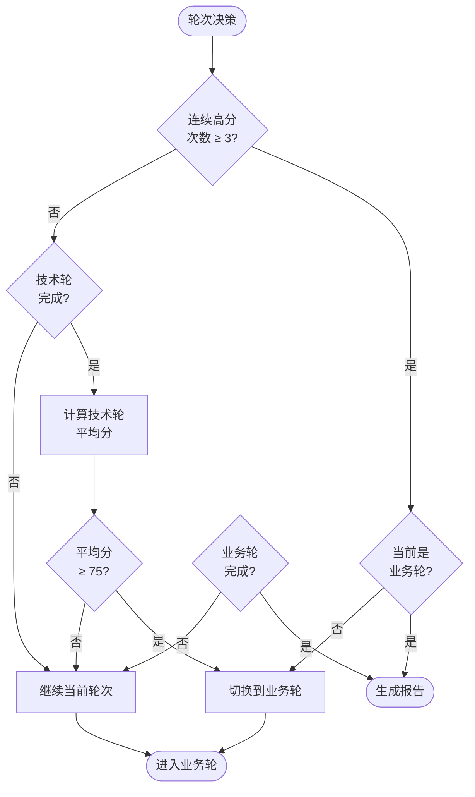
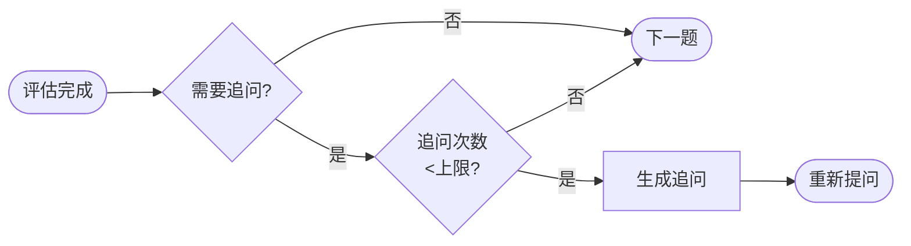
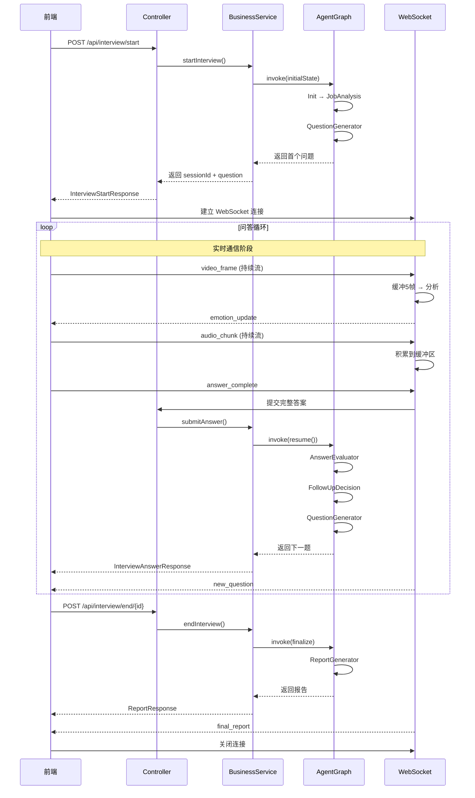
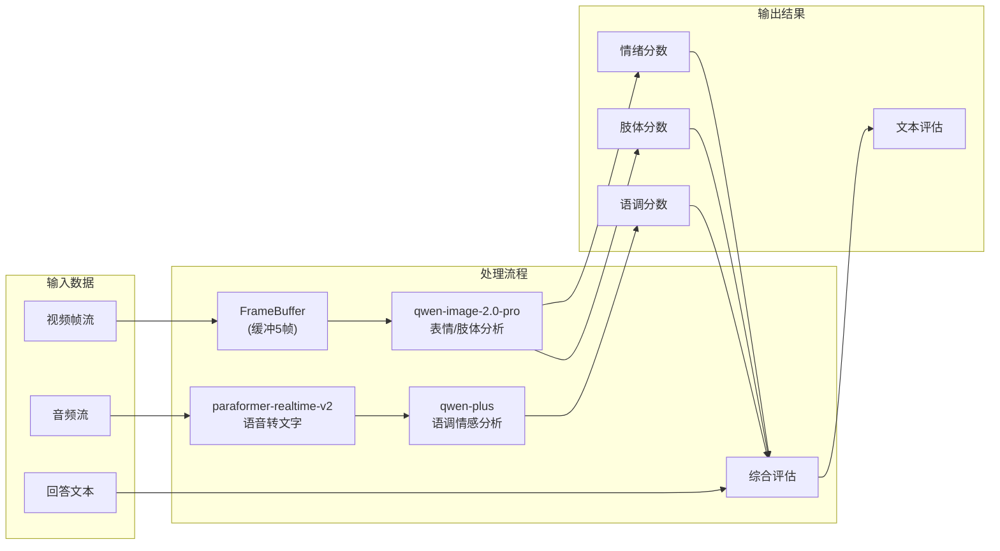

# AI 面试官系统

基于 Spring AI Alibaba + LangGraph4j 构建的多模态 AI 面试系统，支持实时视频分析、语音评估和智能追问。

## 技术栈

| 组件 | 版本 | 说明 |
|------|------|------|
| Java | 21 | 支持 Virtual Threads |
| Spring Boot | 3.4.4 | 基础框架 |
| Spring AI | 1.0.0 | Spring 官方 AI 框架 |
| Spring AI Alibaba | 1.0.0.2 | DashScope 原生集成（Chat/Vision/ASR） |
| LangGraph4j | 1.8.11 | 有状态多步骤工作流引擎 |
| PostgreSQL + pgvector | - | 数据库与向量存储 |
| MyBatis-Plus | 3.5.9 | ORM 框架 |

### 模型配置

| 用途 | 模型 | 说明 |
|------|------|------|
| 文本生成/评估 | qwen-plus | 面试问题生成、答案评估、情感分析 |
| 视觉分析 | qwen-image-2.0-pro | 视频帧表情识别、肢体语言分析 |
| 语音转录 | paraformer-realtime-v2 | 实时 ASR 语音转文字 |

## 核心功能

### 1. 智能面试流程
- 根据简历和岗位自动生成针对性问题
- 支持技术基础、项目经验、业务理解、软技能等多维度考察
- 智能追问机制，深入挖掘候选人能力

### 2. 多模态评估
- **视频分析**: 表情识别、肢体语言评估
- **语音分析**: 语调情感、表达流畅度
- **文本评估**: 内容准确性、逻辑清晰度、自信程度

### 3. 实时交互
- WebSocket 实时推送问题
- 实时情感和肢体语言反馈
- 面试结束生成综合报告

## 项目实现原理

### 整体架构

系统采用 **LangGraph4j 主图 + 子图** 架构，将面试流程建模为有向状态图。主图管理整体面试流程（岗位分析→技术轮→业务轮→报告），每个轮次通过可复用的子图实例执行（生成问题→等待回答→评估→追问决策）。

```mermaid
graph TB
    subgraph MainGraph["InterviewAgentGraph 主图"]
        START([START]) --> INIT[InitInterviewNode<br/>初始化面试]
        INIT --> JOB[JobAnalysisNode<br/>岗位分析]
        JOB --> TECH[InterviewRoundGraph<br/>技术轮子图]
        TECH --> ROUTER[RoundTransitionNode<br/>轮次决策]
        ROUTER -->|技术轮未完成| TECH
        ROUTER -->|切换业务轮| BIZ[InterviewRoundGraph<br/>业务轮子图]
        ROUTER -->|提前结束| REPORT[ReportGeneratorNode<br/>生成报告]
        BIZ --> ROUTER
        ROUTER -->|业务完成| REPORT
        REPORT --> END([END])
    end

    subgraph SubGraph["InterviewRoundGraph 子图 (可复用)"]
        SUB_START([START]) --> GEN[QuestionGeneratorNode<br/>生成问题]
        GEN --> ASK[AskQuestionNode<br/>记录问题]
        ASK --> WAIT[WaitForAnswerNode<br/>等待回答]
        WAIT --> EVAL[AnswerEvaluatorNode<br/>多模态评估]
        EVAL --> FOLLOW[FollowUpDecisionNode<br/>追问决策]
        FOLLOW -->|需要追问| GEN_FOLLOW[GenerateFollowUpNode<br/>生成追问]
        FOLLOW -->|不需要追问| SUB_END([END])
        GEN_FOLLOW --> ASK
    end
```



### Agent 编排详解

#### 节点职责列表

| 节点名称 | 类名 | 职责描述 |
|---------|------|---------|
| **init** | InitInterviewNode | 初始化面试状态，设置计数器和轮次信息 |
| **jobAnalysis** | JobAnalysisNode | 分析岗位类型（技术驱动/业务驱动/均衡型），动态分配题目数量 |
| **technicalRound** | InterviewRoundGraph | 技术轮子图实例（可复用组件） |
| **businessRound** | InterviewRoundGraph | 业务轮子图实例（可复用组件） |
| **roundTransition** | RoundTransitionNode | 检查轮次完成状态，判断是否切换轮次或提前结束 |
| **generateReport** | ReportGeneratorNode | 生成综合评估报告 |
| **generateQuestion** | QuestionGeneratorNode | 根据简历、岗位信息和已问问题生成新问题 |
| **askQuestion** | AskQuestionNode | 将问题添加到问题列表 |
| **waitForAnswer** | WaitForAnswerNode | 中断流程，等待候选人提交答案 |
| **evaluateAnswer** | AnswerEvaluatorNode | 多模态评估答案（文本+视频+音频） |
| **followUpDecision** | FollowUpDecisionNode | 决定是否需要追问 |
| **generateFollowUp** | GenerateFollowUpNode | 生成追问问题 |

#### InterviewState 状态字段

```java
// 面试上下文
String resume;              // 简历内容
String jobInfo;            // 岗位信息
String interviewType;      // 面试类型
String sessionId;          // 会话ID

// 问题管理
List<Question> questions;           // 已问问题列表 (累加)
Question currentQuestion;           // 当前问题
int questionIndex;                  // 问题索引
String questionType;                // 问题类型

// 评估相关
String answerText;                  // 回答文本
String answerAudio;                 // 回答音频
List<String> answerFrames;          // 视频帧列表
EvaluationBO currentEvaluation;     // 当前评估结果
List<EvaluationBO> evaluations;     // 评估历史 (累加)

// 多模态分析
List<Integer> emotionScores;        // 情绪分数列表
List<Integer> bodyLanguageScores;   // 肢体语言分数
List<Integer> voiceToneScores;      // 语气语调分数

// 追问控制
int followUpCount;                  // 追问次数
boolean needFollowUp;               // 是否需要追问
String followUpQuestion;            // 追问问题

// 轮次管理
InterviewRound currentRound;        // 当前轮次 (TECHNICAL/BUSINESS)
int technicalQuestionsDone;         // 技术轮已问问题数
int businessQuestionsDone;          // 业务轮已问问题数
List<Integer> technicalRoundScores; // 技术轮分数列表
List<Integer> businessRoundScores;  // 业务轮分数列表

// 岗位分析
JobAnalysisResult jobAnalysisResult; // 岗位分析结果对象

// 熔断机制
int consecutiveLLMFailures;         // 连续LLM失败次数
```

#### 路由决策逻辑

**RoundTransitionRouter（轮次切换路由）**：



**决策条件表**：

| 条件 | 转换 |
|------|------|
| 技术轮完成 && 平均分 ≥ 75 | 技术轮 → 业务轮 |
| 技术轮完成 && 平均分 < 75 | 继续技术轮 |
| 业务轮完成 | 生成报告 |
| 连续3次高分 (≥85分) | 提前结束 |

**EvaluationRouter（追问路由）**：



#### 熔断机制

**CircuitBreakerHelper** 统一管理 LLM 调用失败：

```java
// 成功时重置计数
recordSuccess() → consecutiveLLMFailures = 0

// 失败时递增计数
handleFailure() → consecutiveLLMFailures++
                  if (>= 3) → 抛出异常触发熔断
```

所有 Node 在调用 LLM 后都需调用：
- 成功: `CircuitBreakerHelper.recordSuccess(updates)`
- 失败: `CircuitBreakerHelper.handleFailure(state, updates, e)`

### 状态管理

`InterviewState` 继承 LangGraph4j 的 `AgentState`，包含以下状态类别：

- **面试上下文**: 简历、岗位信息、面试类型
- **问题管理**: 当前问题、问题索引、问题类型、已问问题列表
- **回答与评估**: 答案文本、音频、视频帧、评估结果
- **轮次管理**: 当前轮次（技术/业务）、已完成问题数、轮次分数
- **追问控制**: 追问计数、追问建议、多模态追问建议
- **熔断机制**: 连续 LLM 失败计数，达到阈值（3次）自动终止

### 多模态分析流水线

```
视频帧 ──→ qwen-image-2.0-pro ──→ 表情/肢体语言评分
音频数据 ──→ paraformer-realtime-v2 ──→ 文字转录 ──→ qwen-plus ──→ 语调情感分析
文本回答 ────────────────────────────→ qwen-plus ──→ 综合评估（准确度/逻辑/流畅度/自信）
```

三个模型各司其职，通过 `MultimodalAnalysisService` 统一调度，最终由 `AnswerEvaluatorNode` 根据问题类型选择对应评估模板，输出综合评分和追问建议。

### 面试流程详解

1. **岗位分析** (`JobAnalysisNode`): 分析 JD 判断岗位类型（技术驱动/业务驱动/均衡型），动态分配技术轮和业务轮题目数量
2. **问题生成** (`QuestionGeneratorNode`): 结合简历、岗位、已问问题和知识库检索结果生成面试问题，支持 8 种问题类型
3. **等待回答** (`WaitForAnswerNode`): 通过 LangGraph4j 中断机制暂停流程，等待候选人通过 API/WebSocket 提交答案
4. **答案评估** (`AnswerEvaluatorNode`): 调用多模态分析流水线，根据问题类型选择评估标准，输出六维评分
5. **追问决策** (`FollowUpDecisionNode`): 根据评估结果和追问次数上限决定是否追问
6. **轮次转换** (`RoundTransitionNode`): 技术轮完成后切换到业务轮，支持连续高分提前结束
7. **报告生成** (`ReportGeneratorNode`): 综合两轮表现生成面试报告

### 熔断与容错

- **LLM 熔断**: 连续 LLM 调用失败 3 次自动抛出异常终止图执行，避免死循环
- **重试策略**: Spring AI 配置最大重试 3 次，指数退避（1s→2s→4s），仅对 429/5xx 重试
- **递归限制**: 主图 recursionLimit=25，子图 recursionLimit=15
- **节点兜底**: 各节点 catch 异常后返回默认值并递增失败计数，成功时重置为 0

### 知识库 (RAG)

基于 pgvector 向量存储实现：
- 按岗位信息语义检索参考面试题
- 支持按问题类型（技术面/业务面）过滤
- LLM 辅助过滤不相关内容

### Prompt 模板管理

系统使用 18 个 `.st` 模板文件（StringTemplate），按功能分类：

- **问题生成**: `question-generator.st`, `question-generator-technical.st`, `question-generator-business.st`, `question-generator-project.st`, `question-generator-soft.st`
- **答案评估**: `evaluation.st`, `evaluation-technical.st`, `evaluation-business.st`, `evaluation-project.st`, `evaluation-soft.st`
- **多模态分析**: `video-analysis.st`, `audio-analysis.st`, `audio-emotion-analysis.st`
- **流程控制**: `followup-decision.st`, `job-analysis.st`, `report-generator.st`, `question-analysis.st`, `knowledge-filter.st`

## 前后端交互详解

### 双通道通信架构

系统采用 **REST API + WebSocket** 双通道通信模式：

- **REST API**：处理核心流程控制（同步调用）
- **WebSocket**：处理实时数据传输（异步推送）

```mermaid
graph TB
    subgraph Frontend["前端应用"]
        REST_CLIENT["REST Client"]
        WS_CLIENT["WebSocket Client"]
    end

    subgraph Backend["后端服务"]
        CONTROLLER["InterviewController<br/>REST API"]
        WS_HANDLER["InterviewWebSocketHandler"]
        BUSINESS["InterviewBusinessService"]
        AGENT["InterviewAgentGraph<br/>(LangGraph4j)"]
    end

    subgraph AI["AI 服务"]
        CHAT["qwen-plus<br/>文本生成/评估"]
        VISION["qwen-image-2.0-pro<br/>视觉分析"]
        ASR["paraformer-realtime-v2<br/>语音转录"]
    end

    REST_CLIENT -->|POST /api/interview/start| CONTROLLER
    REST_CLIENT -->|POST /api/interview/answer| CONTROLLER
    REST_CLIENT -->|GET /api/interview/report/{id}| CONTROLLER

    WS_CLIENT -.->|ws://localhost/ws/interview/{id}| WS_HANDLER

    CONTROLLER --> BUSINESS
    WS_HANDLER --> BUSINESS

    BUSINESS --> AGENT
    AGENT -.->|文本生成| CHAT
    AGENT -.->|视觉分析| VISION
    AGENT -.->|语音转录| ASR

    WS_HANDLER -.->|实时推送| WS_CLIENT
```

### REST API 端点

| 端点 | 方法 | 描述 | 请求体 | 响应 |
|------|------|------|--------|------|
| `/api/interview/start` | POST | 开始面试 | `StartInterviewRequest` | `InterviewStartResponse` |
| `/api/interview/answer` | POST | 提交答案 | `SubmitAnswerRequest` | `InterviewAnswerResponse` |
| `/api/interview/session/{sessionId}` | GET | 获取会话状态 | - | `SessionResponse` |
| `/api/interview/end/{sessionId}` | POST | 结束面试 | - | `ReportResponse` |
| `/api/interview/report/{sessionId}` | GET | 获取面试报告 | - | `ReportResponse` |
| `/api/health` | GET | 健康检查 | - | `HealthResponse` |
| `/api/info` | GET | 服务信息 | - | `InfoResponse` |

### WebSocket 消息协议

#### 连接地址
```
ws://localhost:8080/ws/interview/{sessionId}
```

#### 客户端 → 服务端

| 消息类型 | 用途 | 格式 |
|----------|------|------|
| `video_frame` | 发送视频帧进行实时表情分析 | `{"type":"video_frame","sessionId":"xxx","frame":"base64..."}` |
| `audio_chunk` | 发送音频块积累用于语音转写 | `{"type":"audio_chunk","sessionId":"xxx","audio":"base64..."}` |
| `answer_complete` | 提交完整回答 | `{"type":"answer_complete","sessionId":"xxx","answerText":"..."}` |
| `emotion_update` | 情感状态更新 | `{"type":"emotion_update","sessionId":"xxx"}` |

#### 服务端 → 客户端

| 消息类型 | 用途 | 格式 |
|----------|------|------|
| `new_question` | 推送新面试问题 | `{"type":"new_question","payload":{"content":"...","questionType":"技术基础"},"timestamp":...}` |
| `emotion_update` | 推送情感分析结果 | `{"type":"emotion_update","payload":{"emotionScore":85,"bodyLanguageScore":80},"timestamp":...}` |
| `evaluation_result` | 推送答案评估结果 | `{"type":"evaluation_result","payload":{"overallScore":85,...},"timestamp":...}` |
| `final_report` | 推送最终面试报告 | `{"type":"final_report","payload":{"report":"# 面试报告..."},"timestamp":...}` |
| `answer_received` | 确认收到回答 | `{"type":"answer_received","payload":{"message":"回答已接收"},"timestamp":...}` |
| `error` | 错误消息 | `{"type":"error","payload":{"message":"错误描述"},"timestamp":...}` |

### 完整面试流程时序图



### 多模态数据流



### 前端集成示例

```javascript
class InterviewClient {
  constructor(sessionId) {
    this.sessionId = sessionId;
    this.ws = null;
  }

  // 建立连接
  connect() {
    this.ws = new WebSocket(`ws://localhost:8080/ws/interview/${this.sessionId}`);
    this.ws.onmessage = (event) => this.handleMessage(JSON.parse(event.data));
  }

  // 发送视频帧
  sendVideoFrame(base64Frame) {
    this.ws.send(JSON.stringify({
      type: "video_frame",
      sessionId: this.sessionId,
      frame: base64Frame
    }));
  }

  // 发送音频块
  sendAudioChunk(base64Audio) {
    this.ws.send(JSON.stringify({
      type: "audio_chunk",
      sessionId: this.sessionId,
      audio: base64Audio
    }));
  }

  // 提交回答
  submitAnswer(answerText) {
    this.ws.send(JSON.stringify({
      type: "answer_complete",
      sessionId: this.sessionId,
      answerText: answerText
    }));
  }

  // 处理消息
  handleMessage(data) {
    switch(data.type) {
      case "new_question":
        this.displayQuestion(data.payload);
        break;
      case "emotion_update":
        this.updateEmotionIndicator(data.payload);
        break;
      case "evaluation_result":
        this.displayEvaluation(data.payload);
        break;
      case "final_report":
        this.displayReport(data.payload);
        break;
    }
  }
}

// 媒体采集示例
async function captureVideoFrames(client) {
  const video = document.getElementById('video');
  const canvas = document.createElement('canvas');

  setInterval(() => {
    canvas.getContext('2d').drawImage(video, 0, 0);
    const base64 = canvas.toDataURL('image/jpeg', 0.8);
    client.sendVideoFrame(base64.split(',')[1]);
  }, 1000); // 每秒1帧
}

async function captureAudioChunks(client) {
  const stream = await navigator.mediaDevices.getUserMedia({ audio: true });
  const mediaRecorder = new MediaRecorder(stream);

  mediaRecorder.ondataavailable = (event) => {
    const reader = new FileReader();
    reader.onloadend = () => {
      client.sendAudioChunk(reader.result.split(',')[1]);
    };
    reader.readAsDataURL(event.data);
  };

  mediaRecorder.start(1000); // 每秒1块
}
```

## 项目结构

```
src/main/java/com/zunff/interview/
├── agent/
│   ├── graph/                           # LangGraph4j 图定义
│   │   ├── InterviewAgentGraph.java     # 主图（岗位分析→技术轮→业务轮→报告）
│   │   └── InterviewRoundGraph.java     # 轮次子图（问题→回答→评估→追问）
│   ├── nodes/                           # 图节点
│   │   ├── InitInterviewNode.java       # 面试初始化
│   │   ├── JobAnalysisNode.java         # 岗位类型分析
│   │   ├── QuestionGeneratorNode.java   # 问题生成（含知识库检索）
│   │   ├── AskQuestionNode.java         # 提问节点
│   │   ├── WaitForAnswerNode.java       # 等待回答（中断点）
│   │   ├── AnswerEvaluatorNode.java     # 答案评估（多模态）
│   │   ├── FollowUpDecisionNode.java    # 追问决策
│   │   ├── GenerateFollowUpNode.java    # 追问生成
│   │   ├── RoundTransitionNode.java     # 轮次转换
│   │   └── ReportGeneratorNode.java     # 报告生成
│   └── router/                          # 路由决策
├── config/                              # 配置类
├── controller/                          # REST 控制器
├── model/                               # 数据模型
├── service/                             # 业务服务
│   ├── InterviewBusinessService.java    # 面试业务编排
│   ├── MultimodalAnalysisService.java   # 多模态分析
│   └── InterviewKnowledgeService.java   # 知识库检索
├── state/
│   └── InterviewState.java              # 面试状态定义
└── websocket/                           # WebSocket 处理
```

## 快速开始

### 前置要求
- JDK 21+
- Maven 3.9+
- PostgreSQL + pgvector
- DashScope API Key

### 1. 配置环境

复制 `application-example.yml` 为 `application-dev.yml` 并填写配置:

```yaml
spring:
  datasource:
    url: jdbc:postgresql://localhost:5432/interview_agent
    username: interview
    password: interview123
  ai:
    dashscope:
      api-key: ${DASHSCOPE_API_KEY}
```

### 2. 运行项目

```bash
mvn spring-boot:run -Dspring-boot.run.profiles=dev
```

### 3. 访问端点

- Swagger UI: `http://localhost:8080/swagger-ui/index.html`
- 健康检查: `http://localhost:8080/api/health`
- 服务信息: `http://localhost:8080/api/info`
- LangGraph Studio: `http://localhost:8080/studio`

### 4. 运行测试

```bash
python3 test/test_api.py
```

## API 接口

### REST API

| 接口 | 方法 | 描述 |
|------|------|------|
| `/api/interview/start` | POST | 开始面试 |
| `/api/interview/answer` | POST | 提交答案 |
| `/api/interview/session/{sessionId}` | GET | 获取会话状态 |
| `/api/interview/end/{sessionId}` | POST | 结束面试 |
| `/api/interview/report/{sessionId}` | GET | 获取面试报告 |
| `/api/health` | GET | 健康检查 |
| `/api/info` | GET | 服务信息 |

### WebSocket

**连接地址**: `ws://localhost:8080/ws/interview/{sessionId}`

#### 客户端 → 服务端消息

| 类型 | 描述 | 格式 |
|------|------|------|
| `video_frame` | 发送视频帧 | `{"type":"video_frame","sessionId":"xxx","frame":"base64..."}` |
| `audio_chunk` | 发送音频块 | `{"type":"audio_chunk","sessionId":"xxx","audio":"base64..."}` |
| `answer_complete` | 提交完整回答 | `{"type":"answer_complete","sessionId":"xxx","answerText":"..."}` |
| `emotion_update` | 情感状态更新 | `{"type":"emotion_update","sessionId":"xxx"}` |

#### 服务端 → 客户端消息

| 类型 | 描述 | 格式 |
|------|------|------|
| `new_question` | 推送新问题 | `{"type":"new_question","payload":{"content":"...","questionType":"技术基础"},"timestamp":...}` |
| `emotion_update` | 情感分析更新 | `{"type":"emotion_update","payload":{"emotionScore":85,"bodyLanguageScore":80},"timestamp":...}` |
| `evaluation_result` | 评估结果 | `{"type":"evaluation_result","payload":{"overallScore":85,...},"timestamp":...}` |
| `final_report` | 最终报告 | `{"type":"final_report","payload":{"report":"# 面试报告..."},"timestamp":...}` |
| `answer_received` | 回答确认 | `{"type":"answer_received","payload":{"message":"回答已接收"},"timestamp":...}` |

#### 问题类型

| 类型 | 说明 |
|------|------|
| 技术基础 | 考察技术栈底层原理掌握程度 |
| 项目经验 | 深入挖掘技术实现细节和架构设计 |
| 技术难点 | 考察解决复杂技术问题的能力 |
| 系统设计 | 考察系统架构设计能力 |
| 业务理解 | 考察业务场景理解和分析能力 |
| 场景分析 | 考察面对具体业务场景的思考能力 |
| 沟通协作 | 考察团队沟通和跨部门协作能力 |
| 职业素养 | 考察职业规划、学习能力和价值观 |

## 配置说明

### application.yml 主要配置

```yaml
spring:
  ai:
    retry:
      max-attempts: 3              # LLM 重试次数
      backoff:
        initial-interval: 1s       # 初始退避间隔
        multiplier: 2              # 退避倍数
        max-interval: 10s          # 最大退避间隔
      on-http-codes: 429,500,502,503
    dashscope:
      api-key: ${DASHSCOPE_API_KEY}
      chat:
        options:
          model: qwen-plus
          temperature: 0.7
      audio:
        transcription:
          options:
            model: paraformer-realtime-v2

interview:
  session:
    max-technical-questions: 6     # 技术轮最大问题数
    max-business-questions: 4      # 业务轮最大问题数
    max-follow-ups-technical: 3    # 技术轮每题最大追问数
    max-follow-ups-business: 2     # 业务轮每题最大追问数
    round-pass-score: 75           # 轮次通过分数阈值
    high-score-threshold: 85       # 高分阈值
    consecutive-high-for-early-end: 3  # 连续高分触发提前结束
  multimodal:
    enabled: true
    vision-model: qwen-image-2.0-pro
```

## 参考资料

- [LangGraph4j 官方文档](https://langgraph4j.github.io/langgraph4j/)
- [Spring AI 官方文档](https://docs.spring.io/spring-ai/reference/)
- [Spring AI Alibaba 官方文档](https://java2ai.com/)
- [通义千问 API 文档](https://help.aliyun.com/zh/dashscope/)
- [MyBatis-Plus 官方文档](https://baomidou.com/)

## License

MIT License
