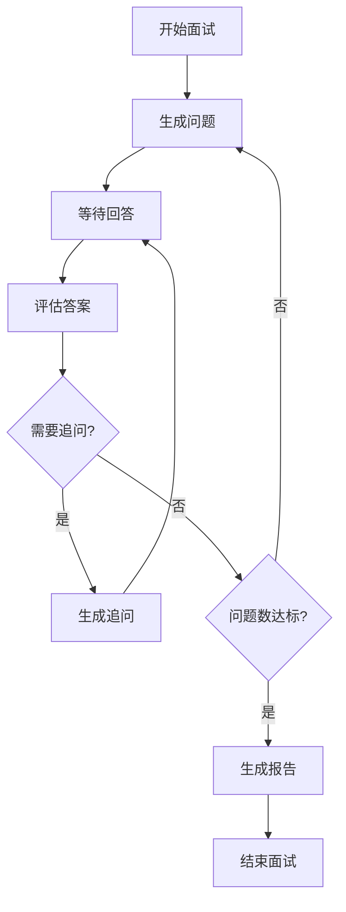

# AI 面试官系统

基于 Spring AI + LangGraph4j 构建的多模态 AI 面试系统，支持实时视频分析、语音评估和智能追问。

## 技术栈

- **Java 21** - 支持 Virtual Threads 和最新特性
- **Spring Boot 3.4.4** - 基础框架
- **Spring AI 1.1.4** - Spring 官方 AI 集成框架
- **LangGraph4j 1.8.11** - 构建有状态多智能体应用
- **MyBatis-Plus 3.5.9** - ORM 框架
- **PostgreSQL + pgvector** - 数据库与向量存储
- **Hutool** - Java 工具库
- **通义千问** - 大语言模型 (兼容 OpenAI API)

## 核心功能

### 1. 智能面试流程
- 根据简历和岗位自动生成针对性问题
- 支持技术基础、项目经验、业务理解、软技能等多维度考察
- 智能追问机制，深入挖掘候选人能力

### 2. 多模态评估
- **视频分析**: 表情识别、肢体语言评估
- **语音分析**: 语调情感、表达流畅度
- **文本评估**: 内容准确性、逻辑清晰度、自信程度

### 3. 实时交互
- WebSocket 实时推送问题
- 实时情感和肢体语言反馈
- 面试结束生成综合报告

## 项目结构

```
src/main/java/com/zunff/agent/
├── AgentApplication.java              # 主应用类
├── config/                            # 配置类
│   ├── AgentConfiguration.java       # Agent 配置
│   ├── InterviewAgentConfiguration.java  # 面试 Agent 图配置
│   ├── MybatisPlusConfig.java        # MyBatis-Plus 配置
│   ├── ServiceConfig.java            # 服务配置
│   └── WebSocketConfig.java          # WebSocket 配置
├── controller/                        # REST 控制器
│   └── InterviewController.java      # 面试 API
├── websocket/                         # WebSocket 处理
│   └── InterviewWebSocketHandler.java
├── service/                           # 业务服务
│   ├── InterviewBusinessService.java # 面试业务服务
│   ├── InterviewSessionService.java  # 会话服务接口
│   ├── impl/                         # 服务实现
│   ├── MultimodalAnalysisService.java # 多模态分析
│   └── VideoStreamService.java       # 视频流服务
├── mapper/                            # MyBatis Mapper
│   ├── InterviewSessionMapper.java
│   ├── AnswerRecordMapper.java
│   └── EvaluationRecordMapper.java
├── model/                             # 数据模型
│   ├── entity/                       # 数据库实体
│   ├── dto/                          # 数据传输对象
│   │   ├── request/                  # 请求对象
│   │   ├── response/                 # 响应对象
│   │   └── websocket/                # WebSocket 消息
│   └── bo/                           # 业务对象
├── agent/                             # Agent 节点
│   └── nodes/
│       ├── QuestionGeneratorNode.java    # 问题生成
│       ├── AnswerEvaluatorNode.java      # 答案评估
│       ├── FollowUpDecisionNode.java     # 追问决策
│       └── ReportGeneratorNode.java      # 报告生成
├── state/                             # 状态定义
│   └── InterviewState.java           # 面试状态
└── common/                            # 公共组件
    ├── exception/                    # 异常处理
    └── response/                     # 统一响应
```

## 快速开始

### 前置要求
- JDK 21+
- Maven 3.9+
- Docker (用于 PostgreSQL)
- 通义千问 API Key

### 1. 配置环境变量

复制 `.env.example` 为 `.env` 并填写配置:

```bash
# 通义千问 API Key
DASHSCOPE_API_KEY=your-dashscope-api-key

# 数据库配置
DB_HOST=localhost
DB_PORT=5432
DB_NAME=interview_agent
DB_USERNAME=interview
DB_PASSWORD=interview123
```

### 2. 启动数据库

```bash
docker-compose up -d
```

### 3. 运行项目

```bash
./mvnw spring-boot:run
```

### 4. 访问端点

- 健康检查: `http://localhost:8080/actuator/health`
- LangGraph Studio: `http://localhost:8080/studio`

## API 接口

### REST API

| 接口 | 方法 | 描述 |
|------|------|------|
| `/api/interview/start` | POST | 开始面试 |
| `/api/interview/answer` | POST | 提交答案 |
| `/api/interview/session/{sessionId}` | GET | 获取会话状态 |
| `/api/interview/end/{sessionId}` | POST | 结束面试 |
| `/api/interview/report/{sessionId}` | GET | 获取面试报告 |

### WebSocket

连接地址: `ws://localhost:8080/ws/interview/{sessionId}`

消息类型:
- `NEW_QUESTION` - 新问题推送
- `EMOTION_UPDATE` - 情感更新
- `EVALUATION_RESULT` - 评估结果
- `FINAL_REPORT` - 最终报告
- `ANSWER_RECEIVED` - 回答确认

## 配置说明

### application.yml 主要配置

```yaml
# 通义千问 API (兼容 OpenAI)
spring:
  ai:
    openai:
      base-url: https://dashscope.aliyuncs.com/compatible-mode/v1
      api-key: ${DASHSCOPE_API_KEY}
      chat:
        options:
          model: qwen-plus
          temperature: 0.7

# 面试系统配置
interview:
  session:
    max-questions: 10      # 最大问题数
    max-follow-ups: 2      # 每题最大追问数
    answer-timeout: 120000 # 回答超时(ms)
```

## 面试流程



## 扩展指南

### 添加新的问题类型

1. 在 `QuestionGeneratorNode` 中扩展 `SYSTEM_PROMPT`
2. 添加新的问题类型到提示词

### 自定义评估维度

1. 修改 `EvaluationBO` 添加新字段
2. 更新 `MultimodalAnalysisService.comprehensiveEvaluate()` 的提示词
3. 更新数据库表 `evaluation_record`

### 集成真实多模态分析

1. 参考 [通义千问 VL API](https://help.aliyun.com/document_detail/2712195.html) 实现视频分析
2. 参考 [通义千问 Audio API](https://help.aliyun.com/document_detail/2712571.html) 实现音频分析

## 参考资料

- [LangGraph4j 官方文档](https://langgraph4j.github.io/langgraph4j/)
- [Spring AI 官方文档](https://docs.spring.io/spring-ai/reference/)
- [通义千问 API 文档](https://help.aliyun.com/zh/dashscope/)
- [MyBatis-Plus 官方文档](https://baomidou.com/)

## License

MIT License
