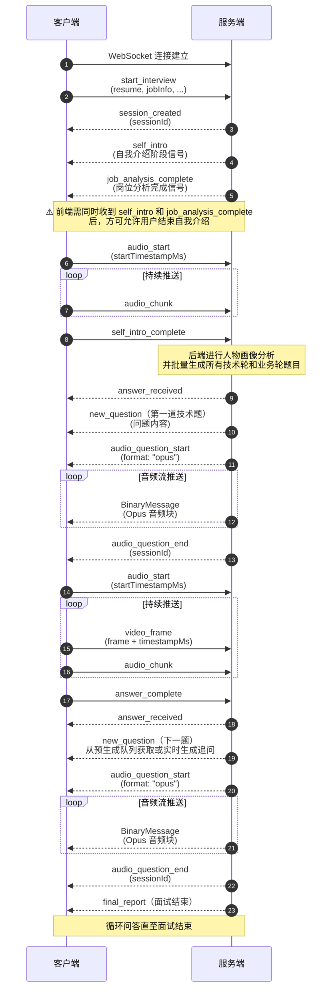

# WebSocket 通信文档

## 连接信息

**连接地址**: `ws://localhost:8080/ws/interview`

所有消息格式统一为：
```json
{
  "type": "消息类型",
  "payload": { /* 消息内容 */ },
  "timestamp": 1699999999999
}
```

## 交互流程



## 客户端 → 服务端

### start_interview - 启动面试

**用途**：创建面试会话并启动图执行

**请求参数**：
```json
{
  "type": "start_interview",
  "resume": "简历文本内容",
  "jobInfo": "Java初级后端",
  "maxTechnicalQuestions": 6,
  "maxBusinessQuestions": 4,
  "maxFollowUps": 2,
  "positionLevel": "senior"
}
```

**字段说明**：
| 字段 | 类型 | 必填 | 默认值 | 说明 |
|------|------|------|--------|------|
| `resume` | string | 是 | - | 候选人简历文本 |
| `jobInfo` | string | 是 | - | 目标岗位信息（JD） |
| `maxTechnicalQuestions` | int | 否 | 6 | 技术轮最大问题数 |
| `maxBusinessQuestions` | int | 否 | 4 | 业务轮最大问题数 |
| `maxFollowUps` | int | 否 | 2 | 每题最大追问数 |
| `positionLevel` | string | 否 | LLM推断 | 岗位级别：`junior`/`mid`/`senior`/`expert` |

**说明**：
- `positionLevel` 可选，如果不传则由 LLM 从 JD 中推断
- 发送后服务端会先返回 `session_created`，然后异步执行：
  1. 岗位分析（并行）
  2. 自我介绍阶段等待（interrupt）
  3. 人物画像分析
  4. 批量题目生成（并行生成技术轮和业务轮所有题目）
  5. 推送第一道技术题
- 第一道题通过 `new_question` 推送，同时推送 TTS 语音

### video_frame - 发送视频帧

**用途**：发送视频帧（缓存，answer_complete 时批量分析）

**请求参数**：
```json
{
  "type": "video_frame",
  "frame": "base64编码的图片数据",
  "timestampMs": 1699999999999
}
```

**说明**：
- `frame`: Base64 编码的 JPEG/PNG 图片，建议每 2-3 秒发送一帧关键帧
- `timestampMs`: **必填**，前端采集该帧时的 UTC 时间戳（毫秒），用于与语音转录时间对齐
- 视频帧会被缓存，在 `answer_complete` 时批量取出进行 Omni 多模态综合评估

### audio_start - 开始录音

**用途**：前端开始录音时发送，携带开始时间戳，启动服务端实时ASR连接

**请求参数**：
```json
{
  "type": "audio_start",
  "startTimestampMs": 1699999999999
}
```

**说明**：
- `startTimestampMs`（必填）：前端录音开始的时间戳（毫秒），用于计算每句话的绝对时间戳
- 必须在 `audio_chunk` 之前发送，否则音频块会被丢弃
- 每次新的回答/自我介绍开始时都需要发送

### audio_chunk - 发送音频块（实时ASR转录）

**用途**：发送音频块，同时进行实时 ASR 转录和 PCM 缓存

**请求参数**：
```json
{
  "type": "audio_chunk",
  "audio": "base64编码的音频数据"
}
```

**说明**：
- `audio`: Base64 编码的音频数据（PCM 格式，16kHz，16bit，单声道）
- 音频块会被**实时**发送给 ASR 模型进行转录，同时缓存原始 PCM 字节
- PCM 缓存用于 `answer_complete` 时转换为 WAV 格式，供 Omni 多模态综合评估使用
- 前端应使用 AudioContext 将录制的音频解码为 PCM 格式发送
- 必须先发送 `audio_start` 启动 ASR 连接，否则音频块会被丢弃
- ASR 模型会实时返回转录文本，服务端自动缓存带时间戳的转录条目

### self_intro_complete - 自我介绍完成信号

**用途**：触发人物画像分析、批量题目生成和第一道技术题推送

**请求参数**：
```json
{
  "type": "self_intro_complete"
}
```

**说明**：
- 发送此信号表示候选人已完成自我介绍
- 服务端会停止 ASR 识别，获取实时转录结果，然后恢复图执行
- 后续流程：
  1. 人物画像分析（结合简历 + 自我介绍）
  2. 批量题目生成（并行生成技术轮和业务轮所有题目）
  3. 推送第一道技术题（`new_question`）
- 此阶段不进行视觉分析，前端只需发送 `audio_start` + `audio_chunk`
- 批量题目生成通常在 2-5 秒内完成，前端无感知

### answer_complete - 回答完成信号

**用途**：触发缓存数据分析和下一题生成

**请求参数**：
```json
{
  "type": "answer_complete"
}
```

**说明**：
- 发送此信号表示候选人已完成当前问题的回答
- 服务端会：
  1. 停止 ASR 识别，获取实时转录结果（带时间戳）
  2. 获取缓存的视频帧（带时间戳）
  3. 获取缓存的 PCM 音频，转换为 WAV 格式
  4. 调用 Qwen-Omni 模型进行综合评估（转录文本 + 关键帧 + 音频，一次调用）
- 分析完成后会推送 `new_question`（下一题或追问）或 `final_report`（面试结束）

## 服务端 → 客户端

### session_created - 会话创建成功

**响应格式**：
```json
{
  "type": "session_created",
  "payload": {
    "sessionId": "dce43fc34e0a4221"
  },
  "timestamp": 1699999999999
}
```

**说明**：
- 收到 `start_interview` 后立即返回，包含分配的 sessionId
- 随后服务端异步执行图，生成第一道题后推送 `new_question`

### self_intro - 自我介绍阶段信号

**响应格式**：
```json
{
  "type": "self_intro",
  "payload": {},
  "timestamp": 1699999999999
}
```

**说明**：
- 面试启动后推送，表示进入自我介绍阶段
- 前端收到后展示自我介绍引导 UI
- 自我介绍阶段只需发送 `audio_chunk`（语音），不需要 `video_frame`
- 自我介绍完成后发送 `self_intro_complete`

### job_analysis_complete - 岗位分析完成信号

**响应格式**：
```json
{
  "type": "job_analysis_complete",
  "payload": {
    "jobType": "均衡型",
    "totalQuestions": 10
  },
  "timestamp": 1699999999999
}
```

**字段说明**：
| 字段 | 类型 | 说明 |
|------|------|------|
| `jobType` | string | 岗位类型（技术驱动型/业务驱动型/均衡型） |
| `totalQuestions` | int | 动态分配的总问题数 |

**说明**：
- 岗位分析完成后推送，与 `self_intro` 并行发出
- **前端必须同时收到 `self_intro` 和 `job_analysis_complete` 两个信号后，才允许用户点击结束自我介绍**，否则 `self_intro_complete` 会因岗位分析未完成而导致后续流程异常
- 即使岗位分析失败（降级为默认配置），也会发送此信号，避免前端永久等待

### answer_received - 回答已接收确认

**响应格式**：
```json
{
  "type": "answer_received",
  "payload": {
    "message": "回答已接收，正在评估中..."
  },
  "timestamp": 1699999999999
}
```

### new_question - 推送新面试问题

**响应格式**：
```json
{
  "type": "new_question",
  "payload": {
    "content": "请介绍一下你在简历中提到的电商系统架构设计",
    "questionType": "技术基础",
    "questionIndex": 1,
    "isFollowUp": false
  },
  "timestamp": 1699999999999
}
```

**字段说明**：
| 字段 | 类型 | 说明 |
|------|------|------|
| `content` | string | 问题内容 |
| `questionType` | string | 问题类型：技术基础/项目经验/技术难点/系统设计/业务理解/场景分析/沟通协作/职业素养/追问 |
| `questionIndex` | int | 问题序号（从 1 开始） |
| `isFollowUp` | boolean | 是否为追问 |

**说明**：
- 推送问题文本后，会紧接着推送 TTS 语音合成音频
- TTS 音频通过独立流程推送：`audio_question_start` → BinaryMessage → `audio_question_end`
- **题目来源**：
  - 普通题目：从批量预生成的队列中获取（`questionIndex` 为预编号）
  - 追问题目：实时生成（`isFollowUp` 为 true）
- 批量预生成机制保证了题目推送的低延迟，追问题目为实时生成以适应动态评估结果

### final_report - 最终面试报告

**响应格式**：
```json
{
  "type": "final_report",
  "payload": {
    "report": "# 面试评估报告\n\n## 综合评价\n...\n\n## 技术能力\n..."
  },
  "timestamp": 1699999999999
}
```

**说明**：
- `report`: Markdown 格式的完整面试评估报告
- 面试结束时推送，包含综合评价、各维度得分、问题回顾等

### audio_question_start - 语音问题开始

**响应格式**：
```json
{
  "type": "audio_question_start",
  "payload": {
    "format": "opus"
  },
  "timestamp": 1699999999999
}
```

**说明**：
- 语音问题合成开始时推送（使用 Qwen-TTS-Realtime WebSocket 模式）
- `format`: 音频格式（Opus，24kHz）

### audio_question_chunk - 语音问题音频块

**传输方式**: WebSocket Binary Frame（非 JSON 文本消息）

**说明**：
- 服务端通过 **WebSocket BinaryMessage** 直接发送原始 Opus 音频字节流
- 每个二进制帧为一个音频分片，客户端应按序拼接
- 音频格式：Opus，采样率 24000Hz
- 客户端可使用 Opus 解码器或直接播放
- **注意**：此消息类型不作为 JSON 文本消息发送，而是直接使用 WebSocket 二进制帧传输，以减少 Base64 编码开销和延迟

**前端接收示例**：
```javascript
ws.onmessage = (event) => {
  if (event.data instanceof ArrayBuffer) {
    // 二进制音频数据（audio_question_chunk）
    audioBuffer.push(event.data);
  } else {
    // JSON 文本消息
    const message = JSON.parse(event.data);
    handleMessage(message);
  }
};
```

### audio_question_end - 语音问题结束

**响应格式**：
```json
{
  "type": "audio_question_end",
  "payload": {
    "sessionId": "interview-xxx"
  },
  "timestamp": 1699999999999
}
```

**说明**：
- 语音问题合成完成时推送（所有二进制音频帧已发送完毕）

### audio_question_error - 语音问题错误

**响应格式**：
```json
{
  "type": "audio_question_error",
  "payload": {
    "message": "语音合成失败: xxx"
  },
  "timestamp": 1699999999999
}
```

**说明**：
- 语音问题合成过程中发生错误时推送（降级为纯文字模式）

### error - 错误消息

**响应格式**：
```json
{
  "type": "error",
  "payload": {
    "message": "答案处理失败: xxx"
  },
  "timestamp": 1699999999999
}
```

## 评估流程说明

### Omni 多模态综合评估

当收到 `answer_complete` 后，服务端会进行一次 Omni 多模态综合评估：

1. **数据收集**：
   - 转录文本 + 每句话的时间戳（来自 Fun-ASR 实时转录）
   - 关键帧截图 + 每帧的时间戳（来自前端 `video_frame`）
   - 原始音频 PCM 数据（转为 WAV 格式）

2. **一次调用 Qwen-Omni**：
   - 将转录文本、关键帧、音频一起发送给 `qwen3.5-omni-plus` 模型
   - 模型可以根据时间戳对应关系，交叉理解语音和视觉信号
   - 例如：看到某时刻皱眉 + 听到该时刻停顿，综合判断为"犹豫"

3. **评分权重**：
   - 技术语义内容（准确性/深度/逻辑/表达）：**75%**
   - 语音副语言（语气/语速/停顿/自信度）：**15%**
   - 关键帧（表情/肢体语言）：**10%**

4. **降级机制**：
   - 若 `interview.multimodal.enabled=false` 或无音视频数据
   - 自动降级为纯文本评估（使用 qwen-plus）
   - 多模态分数字段返回默认值 70

### TTS 语音问题推送流程

每次推送 `new_question` 后，服务端会紧接着推送 TTS 合成的语音音频，流程如下：

1. **推送 `audio_question_start`**：
   - JSON 文本消息，通知前端即将开始推送音频流
   - 包含音频格式信息（Opus，24kHz）

2. **推送音频流（WebSocket BinaryMessage）**：
   - 使用 WebSocket 二进制帧直接传输 Opus 音频字节流
   - 每个二进制帧为一个音频分片，客户端应按序拼接
   - 不使用 JSON 包装，减少 Base64 编码开销和延迟

3. **推送 `audio_question_end`**：
   - JSON 文本消息，通知前端音频流推送结束

**前端处理流程示例**：
```javascript
// 1. 收到 new_question，显示问题文本
// 2. 收到 audio_question_start，准备音频缓冲区
// 3. 循环接收 BinaryMessage，拼接音频数据
// 4. 收到 audio_question_end，播放完整音频

let audioChunks = [];

ws.onmessage = (event) => {
  if (event.data instanceof ArrayBuffer) {
    // 二进制音频块
    audioChunks.push(event.data);
  } else {
    const message = JSON.parse(event.data);

    if (message.type === 'audio_question_start') {
      audioChunks = []; // 重置缓冲区
      const format = message.payload.format; // "opus"
      console.log('开始接收 TTS 音频，格式:', format);
    }

    if (message.type === 'audio_question_end') {
      // 所有音频块接收完成，播放音频
      playAudioChunks(audioChunks);
    }
  }
};

async function playAudioChunks(chunks) {
  // 合并所有音频块
  const totalLength = chunks.reduce((sum, chunk) => sum + chunk.byteLength, 0);
  const audioData = new Uint8Array(totalLength);
  let offset = 0;
  for (const chunk of chunks) {
    audioData.set(new Uint8Array(chunk), offset);
    offset += chunk.byteLength;
  }

  // 创建 Blob 并播放（Opus 格式）
  const blob = new Blob([audioData], { type: 'audio/opus' });
  const audioUrl = URL.createObjectURL(blob);
  const audio = new Audio(audioUrl);
  await audio.play();
}
```

**注意事项**：
- TTS 功能可通过配置 `interview.tts.enabled=false` 关闭
- TTS 失败时会推送 `audio_question_error`，前端应降级为纯文字显示
- 同一时间只有一个 TTS 任务，新问题会中断旧问题的 TTS 合成
